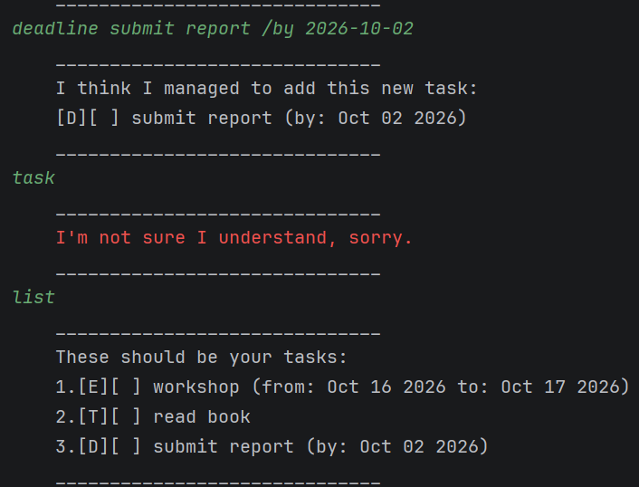
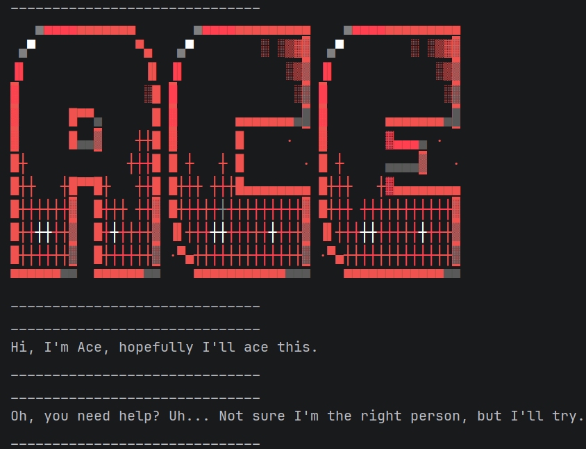

# Ace User Guide

Ace is a command line task manager that helps you keep track of your to-dos, deadlines and events. You can add these types of tasks, mark them as completed, delete them and search for tasks by keyword.

Ace automatically saves your tasks, so they remain available when you restart the application.



## Quick start

### Prerequisites

Before running Ace, make sure you have:

- **Java Development Kit (JDK) 25** installed.
- **IntelliJ IDEA** installed, if you are running Ace from its source code.

### Running Ace in IntelliJ IDEA

1. Download or clone the Ace repository.
2. Open IntelliJ IDEA and select **File → Open**.
3. Select the project's root folder and click **OK**.
4. Go to **File → Project Structure → Project**. Set the Project SDK to **JDK 25** and the language level to **SDK default**.
5. In the Project panel, navigate to `src/main/java/ace/Ace.java`.
6. Right-click `Ace.java` and select **Run 'Ace.main()'**.

Ace will start in IntelliJ's Run console and display its welcome message:



### Running Ace from the JAR file

1. Make sure you have Java 25 installed. You can verify this by running `java -version` in a terminal.
2. Download `ip.jar` from the [latest GitHub release](https://github.com/camimaigrot/ip/releases/latest).
3. Open a terminal and navigate to the folder containing `ip.jar`.
4. Run the following command:

   ```bash
   java -jar ip.jar
   ```

Ace will start in your terminal. Enter `help` to see the available commands.

Ace automatically creates a `data` folder to save your tasks. Run the application from the same folder each time to access your saved tasks.

### Using Ace

Enter a command in the console and press **Enter** to execute it. For example:

```text
todo read book
deadline submit ip /by 2026-10-02
list
```

Ace will add the two tasks and display them when you enter `list`.

To see all available commands, enter:

```text
help
```

To exit the application, enter:

```text
bye
```

Ace saves your tasks automatically whenever you add, update or delete them. Your saved tasks will be loaded the next time you launch the application.

### Command conventions

- Words in angle brackets, such as `<description>`, indicate values you must provide (do not type the brackets themselves).
- Task numbers start at 1. Use `list` to check a task's current number.
- Dates must follow the `yyyy-MM-dd` format, for example, `2026-10-15`.

## Adding to-dos

Use `todo` to add a task that does not have a specific deadline.

**Format:** `todo <description>`

**Example:**
```text
todo read book
```

Ace adds the task to your list and displays a confirmation:

```text
I think I managed to add this new task:
    [T][ ] read book
```

## Adding deadlines

Use `deadline` to add a task that must be completed by a particular date.

**Format:** `deadline <description> /by <date>`

**Example:**
```text
deadline submit report /by 2026-10-15
```

Ace adds the deadline and displays its date in a more readable format:

```text
I think I managed to add this new task:
    [D][ ] submit report (by: Oct 15 2026)
```

## Adding events

Use `event` to add a task associated with a start date and an end date.

**Format:** `event <description> /from <start date> /to <end date>`

**Example:**
```text
event conference /from 2026-10-20 /to 2026-10-22
```

Ace adds the event:

```text
I think I managed to add this new task:
    [E][ ] conference (from: Oct 20 2026 to: Oct 22 2026)
```

The end date must be the same as or later than the start date.

## Viewing your tasks

Use `list` to display all your tasks and their corresponding numbers.

**Format:** `list`

**Example:**
```text
list
```

If you have added the three tasks above, your list will look like this:

```text
These should be your tasks:
    1.[T][ ] read book
    2.[D][ ] submit report (by: Oct 15 2026)
    3.[E][ ] conference (from: Oct 20 2026 to: Oct 22 2026)
```

`[T]` represents a to-do, `[D]` represents a deadline and `[E]` represents an event. `[ ]` means a task is incomplete, while `[X]` means it is completed.

## Marking tasks as completed

Use `mark` followed by a task number to mark a task as completed.

**Format:** `mark <task number>`

**Example:**
```text
mark 1
```

Ace updates the task's completion status:

```text
Oh wow, you managed to finish this task:
    [T][X] read book
```

## Marking tasks as incomplete

Use `unmark` to mark a completed task as incomplete again.

**Format:** `unmark <task number>`

**Example:**
```text
unmark 1
```

Ace updates the task:

```text
I'm sorry, looks like this task isn't done after all:
    [T][ ] read book
```

## Deleting tasks

Use `delete` followed by a task number to remove a task from your list.

**Format:** `delete <task number>`

**Example:**
```text
delete 1
```

Ace removes the selected task and displays a confirmation:

```text
Should be good? I've removed this task:
    [T][ ] read book
    Now you have... 2 tasks in the list.
```

The remaining tasks are renumbered automatically.

## Finding tasks

Use `find` to search for tasks whose descriptions contain a particular keyword. The search is case-insensitive.

**Format:** `find <keyword>`

**Example:**
```text
find report
```

Ace displays the matching tasks. For example, the deadline below matches because its description contains `report`:

```text
Here are the matching tasks in your list:
    2.[D][ ] submit report (by: Oct 15 2026)
```

Searching for `report` or `REPORT` produces the same matches.

## Displaying help

Use `help` to display the available commands, their formats and examples.

**Format:**
```text
help
```

This is useful when you cannot remember a command's syntax.

## Exiting Ace

Use `bye` to end the current session.

**Format:**
```text
bye
```

Your tasks are saved automatically whenever you add, update or delete them. They are loaded again the next time you launch Ace.

## Data storage

Ace stores tasks in `data/ace.txt`, which is created automatically if it does not exist.

Deadlines and event dates are saved in `yyyy-MM-dd` format. Avoid manually editing the data file, as incorrectly formatted entries can prevent Ace from loading your tasks.